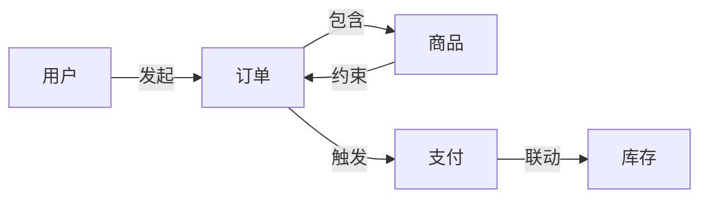
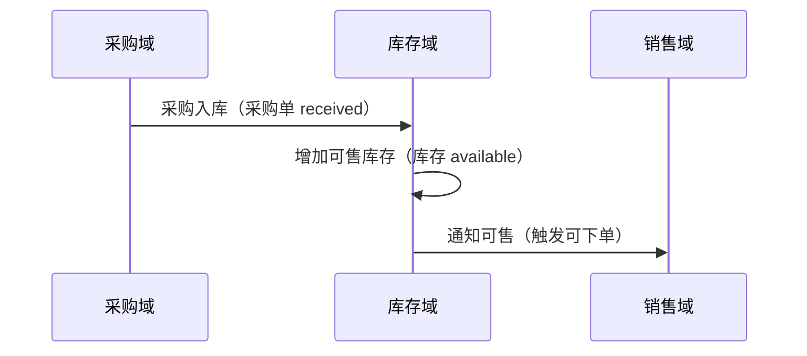

# 文档模板 · 每种业务文档的结构

本文档定义每种业务文档的标准结构。在 Phase 3 确定了要生成哪些文档后，按这里的模板组织内容。

---

## 1. 业务全景图（必备）

**读者**：任何人（零基础）
**目的**：读完知道这个项目"是什么"和"为什么存在"
**文章类型**：`longform` 或 `explainer`
**推荐主题**：`press`（温暖叙事，编辑感，适合零基础入门）/ `freddie`（暖黄友善，让新人觉得亲切）/ `bayer`（包豪斯三原色，品牌感、产品介绍）

### 结构

```
# [项目名称] · 业务全景

## 一句话定义
[25 字以内说清楚这个项目是什么]

## 它解决了什么问题
[从用户角度描述痛点，不是从技术角度]

## 谁在用
[列出 2-4 类目标用户，每类一句话画像]

## 核心价值
[用户为什么选择它而不是别的方案，3-5 条]

## 业务能力一览（三级分层，不是一级平铺）
[业务域 → 业务能力 → 业务操作 三级，让读者看到系统能力的全貌]
- 交易域
  - 订单管理：创建订单 / 取消订单 / 查看订单
  - 支付：发起支付 / 退款 / 对账
- 商品域
  - 商品管理：上架 / 下架 / 改价
  - 库存：锁定 / 释放 / 盘点

## 一个典型的使用故事
[用一个具体场景串联核心能力，500-800 字]

## 和外部世界的关系
[它依赖什么外部系统？它给什么系统提供数据？]
```

---

## 2. 领域模型

**读者**：需要深入理解业务结构的人
**目的**：理解系统的业务实体和它们的关系
**文章类型**：`explainer`
**推荐主题**：`tufte`（数据-墨水，实体表/关系矩阵密集数据最合适）/ `vignelli`（瑞士网格，结构化系统化）

### 结构

```
# [项目名称] · 领域模型

## 领域概览
[这个系统管理哪些业务领域？2-5 个子领域，每个一句话]

## 核心实体
[逐领域列出核心实体]

### [子领域 A]
#### [实体 1]
- 是什么：[一句话]
- 关键属性：[3-5 个业务属性]
- 生命周期：[从创建到结束的状态流转]
- 关系：[和哪些实体有关联]

#### [实体 2]
...

### [子领域 B]
...

## 实体关系总览
[用表格呈现核心实体的关系矩阵]
| | 订单 | 用户 | 商品 | 支付 |
|---|---|---|---|---|
| 订单 | - | 属于用户 | 包含商品 | 对应支付 |
| 用户 | 拥有订单 | - | - | 发起支付 |

## 核心业务概念关系图（必出，不是所有实体的平铺）
[从所有实体中识别 5-10 个核心业务概念——业务故事的"主角"]
[新人理解这几个概念就理解系统 80%]

### 核心概念清单
| 概念 | 一句话定义 | 为什么是核心 | 基础性 |
|------|-----------|-------------|--------|
| 订单 | 用户购买商品的凭证 | 收入载体 + 完整状态机 | 中（依赖用户/商品） |
| 用户 | 系统的使用者 | 枢纽实体，被所有流程引用 | 高（地基概念） |
| 商品 | 可售卖的物品 | 枢纽实体，库存/价格的核心 | 高（地基概念） |

### 概念关系网
[Mermaid flowchart LR，节点是核心概念，边是业务关系标签]
[关系用业务动词：触发/依赖/约束/联动/生成/消费，不用技术动词]



### 枢纽实体
[被 3+ 流程/实体引用的"业务脊柱"，文档重点讲]
- 用户：被订单、支付、售后、权限引用
- 商品：被订单、库存、价格、推荐引用

## 关键业务规则
[跨实体的约束，5-10 条]
```

---

## 3. 核心业务流程

**读者**：需要理解系统怎么运转的人
**目的**：端到端理解关键业务操作——"一单生意从头到尾怎么走"
**文章类型**：`explainer` 或 `full-report`（主线多时）
**推荐主题**：`fuller`（蓝图/工程制图，流程图+状态机+制图感最贴合）/ `tufte`（数据-墨水，多主线 full-report）

### 复杂度判断

| 复杂度 | 主线数 | 文档数 | 组织方式 |
|--------|--------|--------|---------|
| 简单 | 1 条 | 1 份 | 全景→子流程→状态机 |
| 中等 | 2-3 条 | 1 份 | 按主线分章节 |
| 复杂 | 4+ 条 | **按业务域拆分多份** | 每域 1 份 + 1 份跨域主线总览 |

### 结构（主线全景 → 子流程详解 → 状态机）

```
# [项目名称] · 核心业务流程

## 业务主线全景
[1-3 条端到端主线列表，每条一句话 + 主线图]
[主线图：用 Mermaid flowchart 或 SVG 画主线节点序列]

## 主线 1：[业务名字]（如：订单到现金 O2C）
### 主线概览
- 业务目标：[一句话]
- 参与者：[哪些角色/系统]
- 关键实体：[主线实体 + 状态机]
- 状态节点：[节点序列]

### 子流程 1.1：[名称]（如：创建订单）
#### 触发条件
[什么启动了这个子流程]

#### 参与者
[涉及哪些角色/系统]

#### 正常流程
[流程图 + 每步文字说明]
[每步标注：参与者 + 操作 + 状态变化]

#### 状态变化
[实体状态迁移：A → B]
[守卫条件：仅 A 状态可触发]

#### 异常分支
| 触发条件 | 系统响应 | 用户感知 | 是否可恢复 |
|---------|---------|---------|-----------|
| 库存不足 | 拒绝创建 | "库存不足" | 不可恢复 |
| 重复提交 | 幂等拦截 | 返回已有订单 | - |

#### 衔接到下一子流程
[Order status=pending → 触发"支付"子流程]

### 子流程 1.2：[名称]（如：支付）
...

### 子流程 1.3：[名称]（如：发货）
...

### 主线 1 状态机
[核心实体的完整状态机图（Mermaid stateDiagram-v2）]
[状态迁移表：当前状态 → 触发事件 → 守卫条件 → 目标状态 → 触发者]

## 主线 2：[业务名字]（如：采购到付款 P2P）
...

## 跨主线关系（深化为跨业务域协作，不能只一张表）
[浅层：一张关系表。深化：跨域协作时序 + 跨域枢纽动作]

### 跨域关系表
| 上游主线 | 下游主线 | 交叉点 | 关系类型 |
|---------|---------|--------|---------|
| P2P | O2C | 采购入库→可售库存 | 上下游依赖 |
| O2C | R2R | 退货触发退款 | 条件分支 |

### 跨域协作时序图
[Mermaid sequenceDiagram，业务域作为参与者，画跨域联动顺序]
[每条跨域协作：哪个域做什么 → 触发哪个域做什么 → 联动结果]



### 跨域枢纽动作
[一个动作触发多个域联动的关键节点，重点讲]
- 订单 paid（支付成功）：同时触发 库存占用 + 发货 + 积分 + 通知
- 订单 cancelled：同时触发 库存释放 + 优惠券退回 + 通知

## 异常与补偿
[跨流程的异常处理和补偿机制]
[哪些异常会触发主线回滚？回滚到什么状态？]
```

### 按业务域拆分多份（复杂项目）

当主线超过 3 条时，按业务域拆分：

```
文档 3a：采购域业务流程
  - 主线：采购到付款 (P2P)
  - 子流程：请购、采购下单、到货验收、入库、对账、付款

文档 3b：销售域业务流程
  - 主线：订单到现金 (O2C)
  - 子流程：下单、支付、拣货、出库、发货、确认收货、开票、收款

文档 3c：库存域业务流程
  - 主线：入库到出库 (I2O)
  - 子流程：入库、上架、盘点、调拨、出库

文档 3d：跨域主线总览
  - 所有主线全景图
  - 跨域交叉关系
  - 跨域异常与补偿
```

---

## 4. 业务规则手册

**读者**：需要精确理解业务约束的人（运营、合规、测试）
**目的**：完整记录系统的业务规则
**文章类型**：`full-report`
**推荐主题**：`vignelli`（瑞士网格，规则表格清晰扫读、reference 感）/ `knuth`（学术严谨编号，规则编号+引用严谨）

### 结构

```
# [项目名称] · 业务规则手册

## 概述
[规则总览：按领域分组，涉及多少条规则]

## [领域 A] 规则

| ID | 触发条件 | 执行动作 | 业务原因 | 可配置 |
|----|---------|---------|---------|--------|
| BR-001 | xxx | xxx | xxx | 是/否 |

## [领域 B] 规则
...

## 规则优先级
[哪些是硬规则（不可违反），哪些是软规则（可协商）]
```

---

## 5. 角色与权限

**读者**：需要理解系统使用角色的人
**目的**：搞清楚谁能做什么
**文章类型**：`explainer`
**推荐主题**：`press`（温暖叙事，角色画像故事感）/ `freddie`（暖黄友善，角色介绍亲切）

### 结构

```
# [项目名称] · 角色与权限

## 角色总览
[列出所有角色，每个一句话]

## 角色详情

### [角色名]
- 画像：[一句话描述这类用户]
- 核心诉求：[他们为什么用这个系统]
- 能做什么：[5-10 项能力]
- 不能做什么：[3-5 项限制]

## 权限矩阵
| 能力 | 普通用户 | VIP 用户 | 运营 | 管理员 |
|------|---------|---------|------|--------|
| 浏览 | ✅ | ✅ | ✅ | ✅ |
| 下单 | ✅ | ✅ | ❌ | ❌ |
| 退款 | ❌ | ✅ | ✅ | ✅ |

## 角色升级路径
[有没有从低权限角色升级到高权限的路径？]
```

---

## 6. 关键概念词汇表

**读者**：任何需要查术语的人
**目的**：快速理解业务术语
**文章类型**：`explainer`
**推荐主题**：`vignelli`（网格、reference、扫读，词汇表索引快速查阅最佳）/ `andy`（温柔治愈，术语解释亲切）

### 结构

```
# [项目名称] · 关键概念词汇表

## 按领域浏览

### [领域 A]
- **[术语]**：[一句话定义] · 类比：[通俗类比] · 例子：[具体例子]
- **[术语]**：...

### [领域 B]
...

## 按字母索引
[A-Z 排序的术语列表，只写术语名 + 一句话 + 跳转链接]
```

---

## 7. 系统架构（业务视角）

**读者**：需要理解系统边界和外部依赖的人
**目的**：搞清楚系统在更大的业务版图中的位置
**文章类型**：`explainer`
**推荐主题**：`fuller`（蓝图/工程制图，架构图+系统边界最贴合）/ `shannon`（暗色工程证据，系统设计）

### 结构

```
# [项目名称] · 系统架构（业务视角）

## 系统定位
[在公司的业务版图或用户的工作流中，这个系统处于什么位置]

## 系统边界
[什么归这个系统管，什么不归它管]

## 外部依赖
[这个系统依赖哪些外部系统/服务来完成业务]
| 外部系统 | 依赖什么 | 如果它挂了会怎样 |
|---------|---------|----------------|

## 数据流向
[从业务视角描述数据怎么在系统间流转]

## 用户入口（全枚举，不只列渠道）
[每个入口类型 = 一类业务操作的来源，全枚举确保不遗漏业务能力]

| 入口类型 | 入口清单 | 翻译成的业务操作 |
|---------|---------|----------------|
| HTTP API | POST /api/orders, POST /api/orders/{id}/cancel | 创建订单、取消订单 |
| CLI 命令 | sync-inventory, generate-report | 同步库存、生成报表 |
| 消息消费者 | consume order.created, consume payment.success | 处理订单创建、处理支付成功 |
| 定时任务 | 每日 0 点对账、每小时库存校准 | 日常对账、库存校准 |
| Webhook | payment.success callback, shipping.update | 处理支付回调、物流更新 |
| 后台管理 | 后台改价、后台审核 | 运营改价、内容审核 |

[每个入口都翻译成业务操作，与"业务能力一览"对照——有没有入口没对应到业务能力？有没有业务能力没有入口？两者都要补]
```

---

## 8. 状态机手册（可选，复杂项目推荐）

**读者**：需要精确理解实体生命周期的人（开发、测试、运营）
**目的**：完整记录每个核心实体的状态流转——什么触发迁移、什么阻止迁移、迁移时发生什么
**文章类型**：`full-report`
**推荐主题**：`shannon`（暗色工程证据，状态机+工程证据最贴合）/ `fuller`（蓝图/工程制图，状态图制图感）/ `knuth`（学术严谨编号，状态迁移表严谨）

### 什么时候单独出这份文档

| 情况 | 处理 |
|------|------|
| 核心实体 ≤ 2 个，状态机简单 | 不单独出，并入"核心业务流程"文档 |
| 核心实体 3+ 个，或单个实体状态 ≥ 6 个 | **单独出状态机手册** |
| 跨多个业务域都有状态机 | 必出，作为跨域一致性参照 |
| **全量深挖模式（模式 B）** | **必出**，且所有有 status 字段的实体都画状态机（不限核心实体）；复杂项目按业务域拆分多份 |

> 🔧 **全量深挖模式（模式 B）下**：状态机手册覆盖**所有**有 status 字段的实体，不限核心实体。每个状态机都画完整迁移图 + 迁移表（含守卫条件/触发者/副作用）+ 异常回滚 + 跨实体联动。复杂项目按业务域拆分（每域 1 份状态机手册）。

### 结构

```
# [项目名称] · 状态机手册

## 概述
[本手册记录哪些实体的状态机；为什么状态机重要——它是业务流程最可靠的"事实骨架"]
[阅读指引：先看全景表，再按实体深入]

## 状态机全景

| 实体 | 状态数 | 关键分支 | 所属主线 | 复杂度 |
|------|--------|---------|---------|--------|
| 订单 | 8 | 支付超时、退款、取消 | O2C | 高 |
| 库存 | 4 | 锁定/释放 | O2C + P2P | 中 |
| 采购单 | 6 | 验收失败、退换货 | P2P | 中 |

## [实体 A] 状态机（如：订单）

### 状态值清单
[从 ENUM/常量提取的所有状态，每个一句话说明]

| 状态值 | 业务含义 | 是否终态 |
|--------|---------|---------|
| pending | 待支付，订单已创建等待付款 | 否 |
| paid | 已支付，待发货 | 否 |
| shipped | 已发货，待收货 | 否 |
| completed | 已完成 | 是（正常终态） |
| cancelled | 已取消 | 是（异常终态） |
| refunded | 已退款 | 是（异常终态） |

### 状态迁移图
[Mermaid stateDiagram-v2，含所有状态和迁移]

### 状态迁移表
[完整迁移规则，含守卫条件]

| 当前状态 | 触发事件 | 守卫条件 | 目标状态 | 触发者 | 副作用 |
|---------|---------|---------|---------|--------|--------|
| pending | 用户支付成功 | 金额匹配 | paid | 支付网关回调 | 释放库存锁定、发通知 |
| pending | 30 分钟未支付 | 定时任务扫描 | cancelled | 系统 | 释放库存锁定 |
| paid | 用户申请取消 | 已发货前 | cancelling | 用户 | 触发退款流程 |
| cancelling | 退款成功 | - | refunded | 退款系统 | 通知用户 |

### 异常与回滚
- 哪些状态可以回滚？（如 paid → cancelling 是回滚到取消）
- 哪些状态是终态不可恢复？（如 completed、refunded）
- 跨实体状态联动：订单 cancelled → 触发库存释放、优惠券退回

### 业务规则绑定
[此状态机相关的业务规则 ID，引用业务规则手册]
- BR-001：金额 > 5000 需风控审核（pending → under_review）
- BR-005：取消后 24 小时内不可重下单（防刷）

## [实体 B] 状态机（如：采购单）
...

## 跨实体状态联动
[多个实体的状态如何互相影响]

| 触发实体 | 触发状态 | 影响实体 | 联动动作 |
|---------|---------|---------|---------|
| 订单 | paid | 库存 | 占用库存 → 可发货 |
| 采购单 | received | 库存 | 增加可用库存 |
| 订单 | cancelled | 库存 | 释放锁定库存 |

## 状态机与业务流程对照
[状态机是骨架，流程是肉。说明每个子流程对应哪些状态迁移]

| 子流程 | 起始状态 | 结束状态 | 经过状态 |
|--------|---------|---------|---------|
| 创建订单 | (无) | pending | pending |
| 支付 | pending | paid | pending → paid |
| 发货 | paid | shipped | paid → shipped |
| 确认收货 | shipped | completed | shipped → completed |
```

### 与其他文档的关系

- **核心业务流程**：流程文档讲"怎么走"，状态机手册讲"骨架是什么"
- **业务规则手册**：很多规则的触发点就是状态迁移（如 BR-001 在 pending → under_review 时触发）
- **领域模型**：状态机是实体"生命周期"属性的详细展开

---

## 文档通用原则

1. **先讲全景，再讲细节**：每份文档的第一段让读者知道"我接下来要读什么"
2. **每个概念配例子**：抽象定义后面跟具体例子
3. **图表优于大段文字**：关系用表格，流程用 ASCII 图，层级用缩进
4. **术语首次出现必解释**：不假设读者知道任何行业黑话
5. **结尾给"下一步读什么"**：提示读者按什么顺序继续阅读文档集
6. **文档间交叉引用**：在每份文档结尾和导航首页建立"相关文档"链接，让读者能跳转

### 交叉引用规范

文档不是孤岛。每份文档在两个地方建立交叉引用：

**A. 导航首页 DocCard 的 `related` 字段 + `domain` 分组**：
```tsx
// IndexPage 的 DOCS 数组里每条文档：
{ to: "/business-rules", title: "业务规则手册", desc: "...",
  domain: "交易域",  // 按业务域分组展示
  related: [
    { to: "/state-machine", label: "状态机手册" },  // 规则常绑定状态迁移
    { to: "/domain-model", label: "领域模型" },      // 规则约束实体
  ]
}
```
`domain` 字段让首页按业务域分区（综合/交易域/采购域/库存域...），文档多时不平铺。

**B. 文档结尾的"延伸阅读"段**：每份文档最后一个 Section 写"相关文档"，用 `<Link>` 跳转：
```tsx
<Section index="99" title="延伸阅读">
  <p>想继续深入？推荐：</p>
  <ul>
    <li><Link to="/state-machine">状态机手册</Link> — 本手册的规则 BR-001 在订单 pending→under_review 时触发</li>
    <li><Link to="/domain-model">领域模型</Link> — 本手册约束的实体清单</li>
  </ul>
</Section>
```

**交叉引用搭配关系**（哪些文档互相关联）：

| 文档 | 相关文档 | 为什么相关 |
|------|---------|-----------|
| 业务全景图 | 领域模型、词汇表 | 全景→深入实体；全景→查术语 |
| 领域模型 | 状态机手册、业务规则 | 实体生命周期→状态机；实体约束→规则 |
| 核心业务流程 | 状态机手册、系统架构 | 流程的状态变化→状态机；流程跨域→架构 |
| 业务规则手册 | 状态机手册、领域模型 | 规则绑定状态迁移；规则约束实体 |
| 状态机手册 | 核心业务流程、业务规则 | 状态机是流程骨架；状态迁移触发规则 |
| 系统架构 | 核心业务流程 | 架构边界→流程跨域 |

**引用规则**：
- 用 react-router 的 `<Link to="/xxx">`，不用 `<a href>`（HashRouter 下 `<Link>` 才能正确跳转）
- 引用要说"为什么相关"（如"本手册的规则 BR-001 在 XX 时触发"），不只是列文档名
- 每份文档结尾的"延伸阅读"最多 3 个链接，不要堆砌
