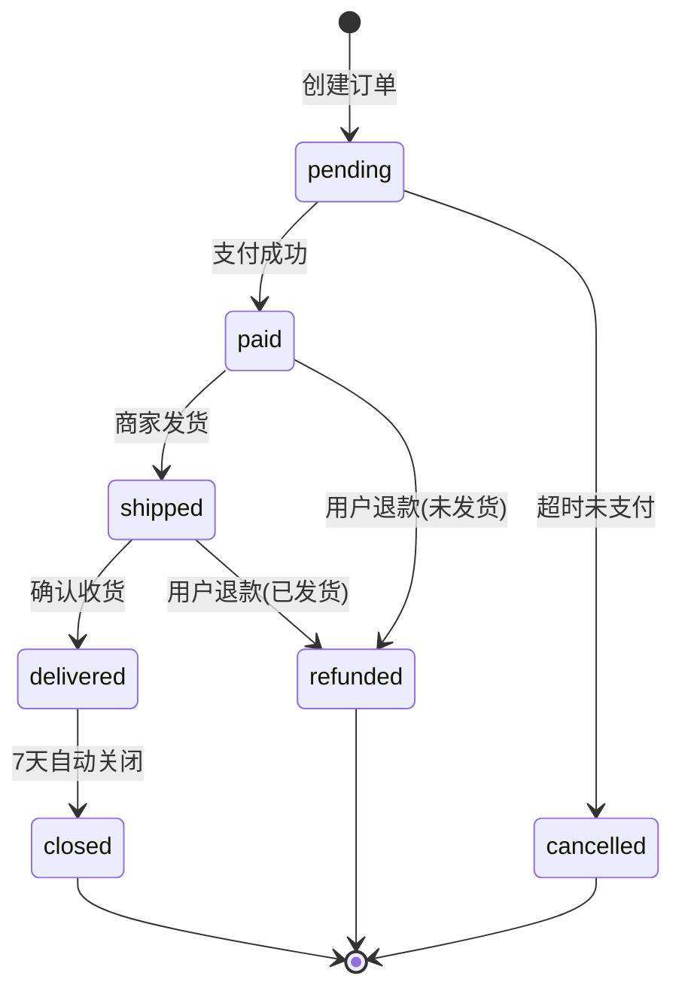

# 状态机提取方法

> 状态机是业务流程的骨架。每个有 `status`/`state` 字段的实体都藏着一个状态机——
> 提取出来，你就有了业务流程最可靠的"事实骨架"。
>
> 状态机比 API 路由更可靠：API 是技术实现，状态机是业务事实（写在数据库 ENUM 里）。

## 为什么要提取状态机

**没有状态机的流程描述**：
```
用户下单 → 系统创建订单 → 用户支付 → 系统发货 → 用户收货
```
这看起来对，但漏了：支付超时会怎样？发货后能取消吗？退款后订单状态变什么？

**有状态机的流程描述**：
```
订单状态机：created → paid → shipped → delivered → closed
                                              ↘ cancelled（仅 created/paid 可取消）
                                  ↘ refunded（仅 paid/shipped/delivered 可退款）
```
每个状态、每条转移线都有明确的触发条件和业务规则。

---

## 提取步骤

### Step 1 · 找有状态字段的实体

```bash
# 数据库 Schema（最可靠）
grep -rE "status|state" --include="*.sql"
# 搜索 ENUM 定义
grep -rE "ENUM|enum" --include="*.sql" --include="*.java" --include="*.ts"

# ORM 模型
grep -rE "status|state" --include="*.java" --include="*.ts" --include="*.go" --include="*.py"
# 常见字段名：status, state, order_status, payment_status, loan_status, task_status
```

### Step 2 · 提取状态值

#### 从数据库 ENUM

```sql
-- MySQL
status ENUM('pending','paid','shipped','closed','cancelled')

-- PostgreSQL
status VARCHAR CHECK (status IN ('pending','paid','shipped','closed','cancelled'))
```

翻译：`pending` → 待支付 / `paid` → 已支付 / `shipped` → 已发货 / `closed` → 已关闭 / `cancelled` → 已取消

#### 从代码常量/枚举

```java
// Java
public enum OrderStatus {
    PENDING,      // 待支付
    PAID,         // 已支付
    SHIPPED,      // 已发货
    DELIVERED,    // 已送达
    CLOSED,       // 已关闭
    CANCELLED,    // 已取消
    REFUNDED      // 已退款
}
```

```typescript
// TypeScript
const ORDER_STATUS = {
  PENDING: 'pending',
  PAID: 'paid',
  SHIPPED: 'shipped',
} as const
```

### Step 3 · 提取状态迁移（边）

状态迁移 = 代码中所有修改状态字段的操作。

```bash
# 搜索状态赋值/更新
grep -rE "status\s*=\s*['\"]|setStatus\(|updateStatus\(|\.status\s*=" --include="*.java" --include="*.ts" --include="*.go" --include="*.py"

# 更精确：搜索状态值之间的迁移
grep -rE "PENDING.*PAID|PAID.*SHIPPED|setStatus.*PAID|status.*=.*paid" --include="*.java"
```

每条迁移记录：
- **从状态** → **到状态**
- **触发条件**：什么操作触发了这次迁移（方法名/API 路由）
- **触发者**：用户操作 / 系统自动 / 外部回调 / 定时任务
- **前置条件**：迁移前需要满足什么（如"仅 pending 状态可取消"）

### Step 4 · 补充守卫条件

搜索状态迁移前的条件判断：

```java
// 这种代码就是守卫条件
if (order.getStatus() == OrderStatus.PENDING) {
    order.setStatus(OrderStatus.CANCELLED);
}
// → 守卫：仅 PENDING 状态可取消

if (order.getStatus() == OrderStatus.PAID && !order.isShipped()) {
    order.setStatus(OrderStatus.REFUNDED);
}
// → 守卫：仅 PAID 且未发货可退款
```

```bash
# 搜索状态检查 + 状态修改的组合
grep -rE "if.*status.*==|getStatus\(\).*==|status\s*===\s*" --include="*.java" --include="*.ts"
```

---

## 产出格式

### 状态机表

| 当前状态 | 触发事件 | 守卫条件 | 目标状态 | 触发者 | 业务含义 |
|---------|---------|---------|---------|--------|---------|
| pending | 用户支付成功 | 金额匹配 | paid | 支付回调 | 订单进入待发货 |
| pending | 30分钟未支付 | - | cancelled | 定时任务 | 超时自动取消 |
| paid | 商家发货 | - | shipped | 商家操作 | 订单进入待收货 |
| shipped | 用户确认收货 | - | delivered | 用户操作 | 订单进入待评价 |
| delivered | 7天自动 | 未退款 | closed | 定时任务 | 订单完成 |
| paid | 用户申请退款 | 未发货 | refunded | 用户操作 | 退款处理中 |
| shipped | 用户申请退款 | 已发货未签收 | refunded | 用户操作 | 需退货后退款 |

### Mermaid 状态机图



---

## 状态机与业务流程的关系

状态机是"骨架"，业务流程是"血肉"。

```
状态机骨架：
  pending → paid → shipped → delivered → closed

业务流程（骨架 + 血肉）：
  [pending] 用户下单
    → 系统校验库存
    → 系统锁定库存
    → 系统发起支付
    → 用户完成支付
  [paid] 系统通知商家发货
    → 商家拣货
    → 商家发货
  [shipped] 物流配送
    → 用户签收
  [delivered] 等待7天
  [closed] 订单完成
```

每个状态转移对应一个子流程，状态机就是子流程的"连接器"。

---

## 常见模式

### 线性状态机（最简单）

```
created → submitted → approved → completed
```
适用：审批流、申请类业务

### 分支状态机

```
            → approved → completed
submitted ─┤
            → rejected → [*]
```
适用：有审核的业务

### 回环状态机

```
draft → review → revise(回到draft)
                  → approve → published
```
适用：内容管理、迭代类业务

### 多轴状态机

有些实体有**多个独立的状态维度**，不是一条线，而是正交的：

```
订单：
  支付状态：unpaid → paid → refunded
  物流状态：unshipped → shipped → delivered
  关闭状态：active → closed

三个维度独立变化，组合出 3×3×2 = 18 种状态
```

对于多轴状态机：
- 分别画每个维度的状态机
- 用表格说明哪些组合是合法的（如 `paid + unshipped` 合法，`unpaid + shipped` 不合法）

---

## 完成标准

- [ ] 识别了所有有状态字段的核心实体（≥2个）
- [ ] 每个核心实体提取了完整的状态机表（状态值 + 迁移 + 守卫条件）
- [ ] 至少 1 个核心实体有 Mermaid `stateDiagram-v2` 图
- [ ] 状态机与业务流程的对应关系已说明
- [ ] 异常/取消/回滚的状态迁移已覆盖

---

## 与其它参考的关系

- 状态机是 `end-to-end-mainline.md` 方法 3（主线实体生命周期串联法）的基础
- 状态机渲染 → `diagram-guide.md` 的 `stateDiagram-v2` 模板
- 状态机守卫条件 → `analysis-methods.md` 2.3 节业务规则的来源
- 状态机文档模板 → `document-templates.md` #5 状态机手册（新增）
